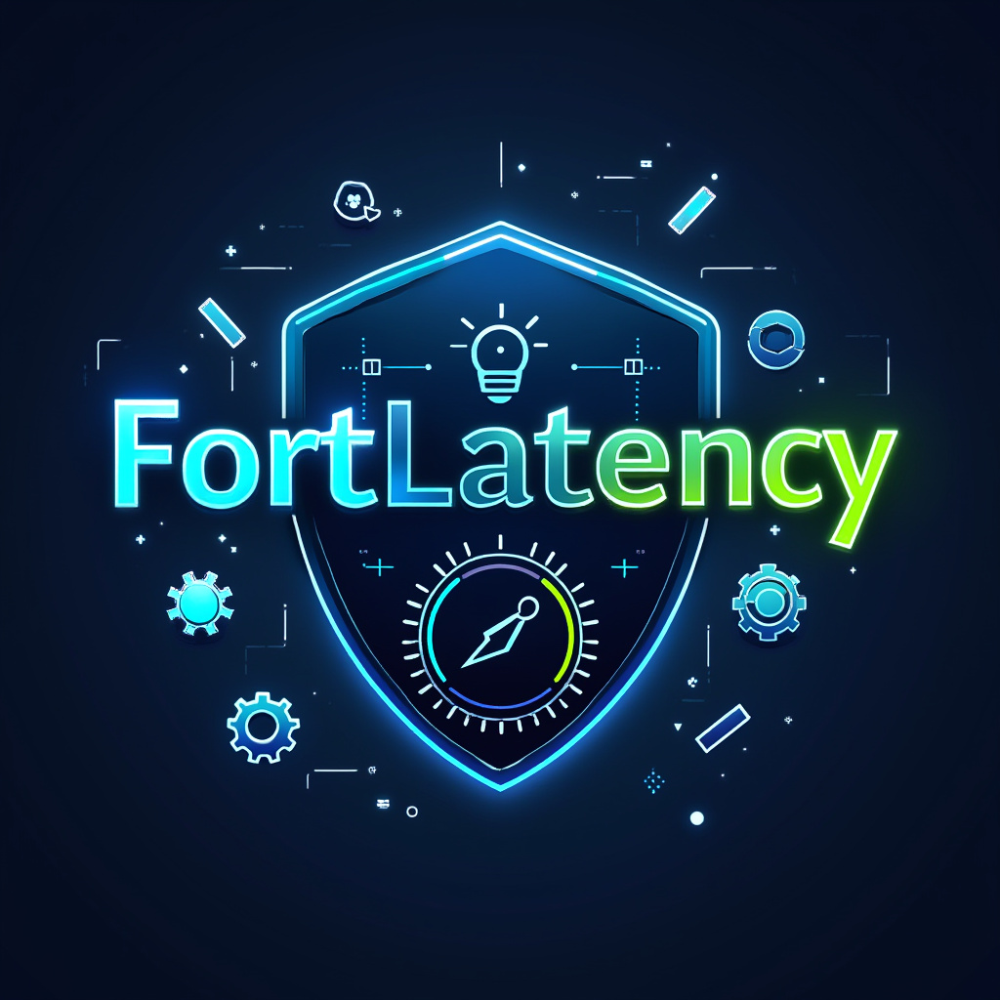

# FortLatency Pro 🚀

FortLatency Pro is a powerful optimization tool designed specifically for Fortnite players who want to minimize input lag, enhance system performance, and achieve a smoother gaming experience.

## ✨ Features

- **Real-time Performance Monitoring**
  - Track Fortnite's status and FPS
  - Monitor system load
  - Detect interfering processes
  - Display current timer resolution

- **System Optimizations**
  - Reduce system latency
  - Optimize keyboard response
  - Enhance visual performance
  - Manage system services
  - Configure power settings

- **Game-specific Enhancements**
  - Prioritize Fortnite processes
  - Optimize system resources
  - Reduce input lag
  - Improve overall responsiveness

## 🔧 Installation

1. Download the latest release from the [Releases](https://github.com/wwishh777/FortLatency/releases) page
2. Run the installer as administrator
3. Launch FortLatency Pro
4. Click "OPTIMIZE" to apply performance enhancements

## 💻 System Requirements

- Windows 10/11
- Administrative privileges
- Fortnite installed
- Minimum 8GB RAM
- DirectX 11 compatible graphics card

## 🎮 Usage

1. **Launch the Application**
   - Run FortLatency Pro as administrator
   - The main interface will display current system status

2. **Optimize Performance**
   - Click the "OPTIMIZE" button to apply performance enhancements
   - Follow the prompts for system restart if required

3. **Monitor Status**
   - Track real-time performance metrics
   - Monitor for interfering processes
   - View current system optimizations

4. **Restore Settings**
   - Use the "RESTORE" button to revert changes
   - System will return to default configuration

## ⚠️ Important Notes

- Always run as administrator
- Some optimizations require a system restart
- Backup your system before making changes
- For best results, close unnecessary applications
- Optimizations are specifically tailored for Fortnite
- **About Antivirus Detection:**
  - FortLatency Pro may trigger false positives in some antivirus software, including VirusTotal
  - This is common for optimization tools that modify system settings
  - You can verify the safety by:
    1. Checking the file's digital signature
    2. Scanning with reputable antivirus software
    3. Monitoring system changes made by the application
    4. Verifying the executable hash matches our official release
  - While we understand the concern about false positives, we prioritize user privacy and security, therefore the source code remains private
  - All modifications made by FortLatency are transparent and can be reversed using the "RESTORE" button

## 🛠️ Technical Details

FortLatency Pro implements various system optimizations including:
- Timer resolution adjustment
- Process priority management
- Service optimization
- Visual effects configuration
- Keyboard response enhancement
- Power plan optimization

## 💝 Support the Project

If you find FortLatency Pro useful, consider supporting its development:

---

Made with ❤️ for the Fortnite community

